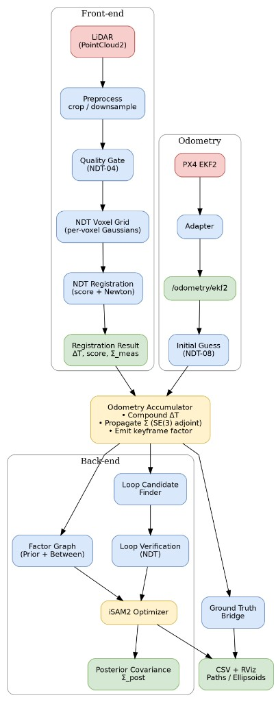
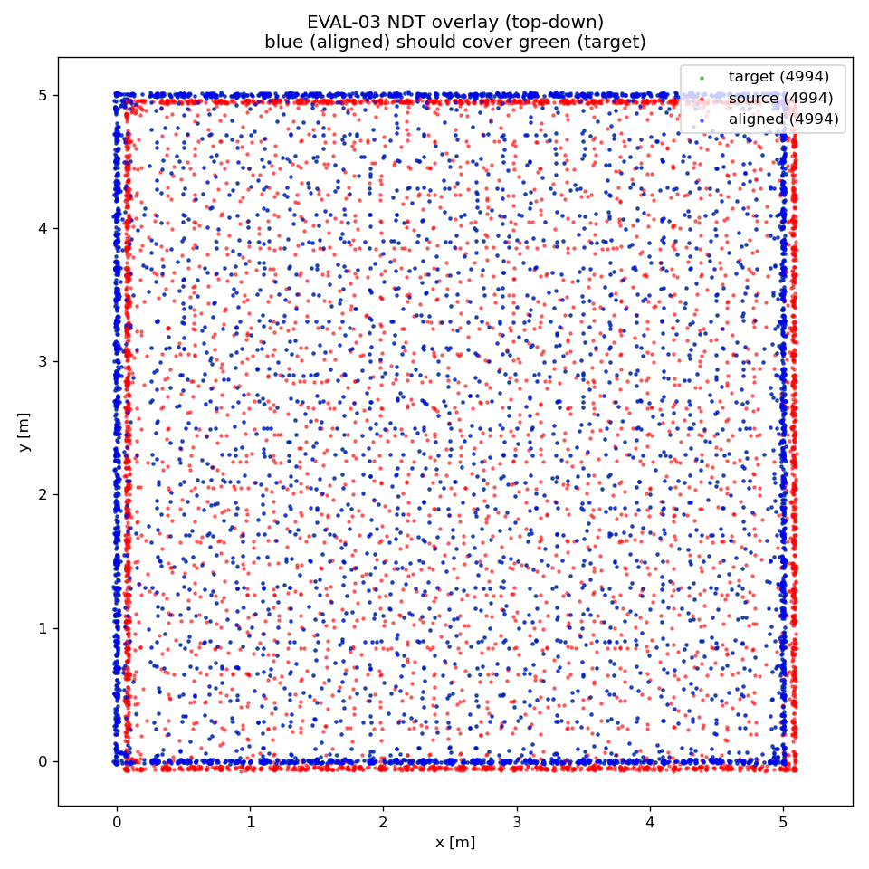
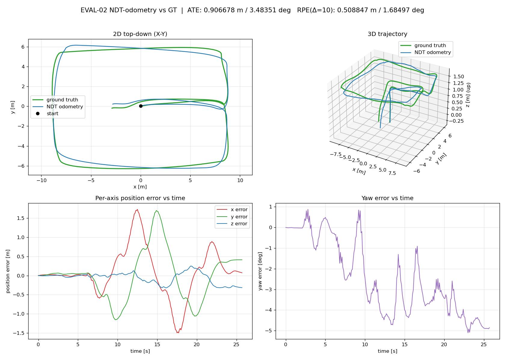
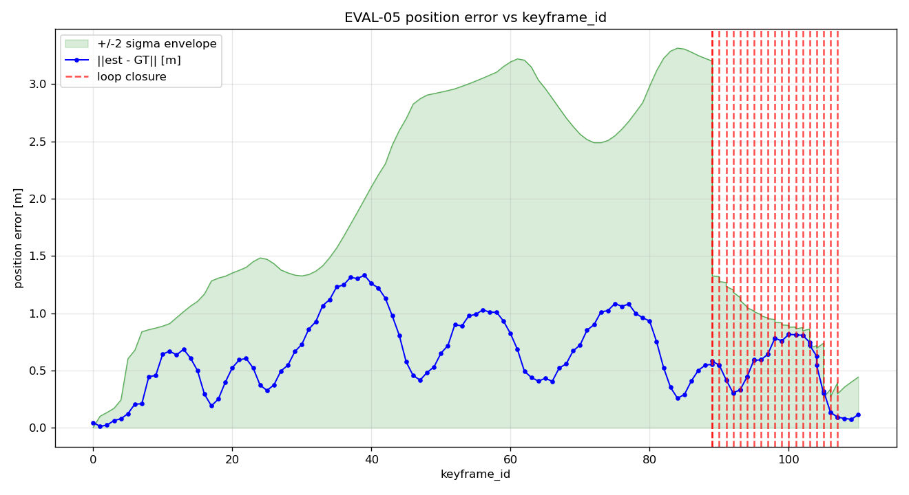
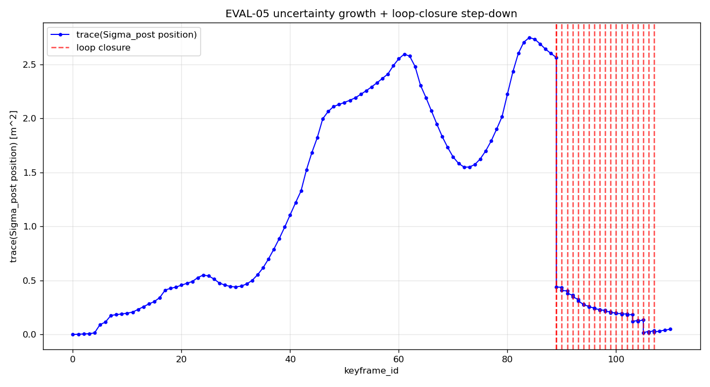
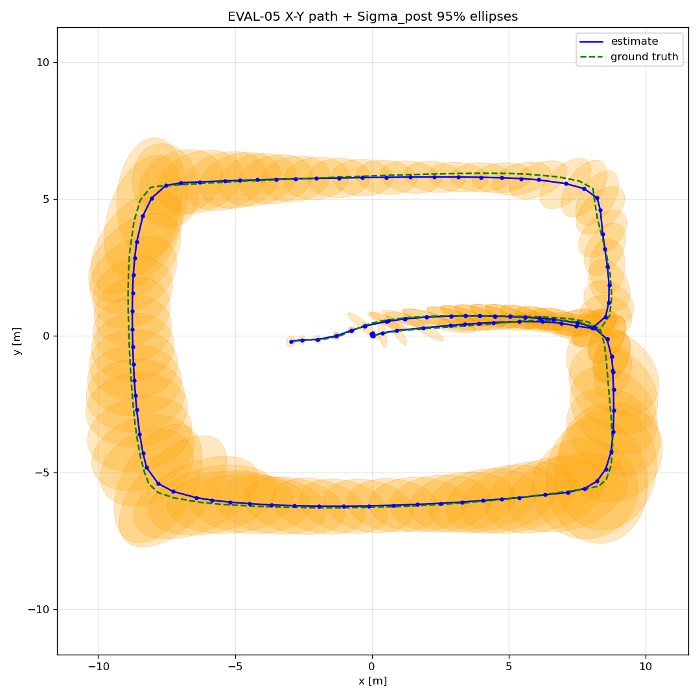
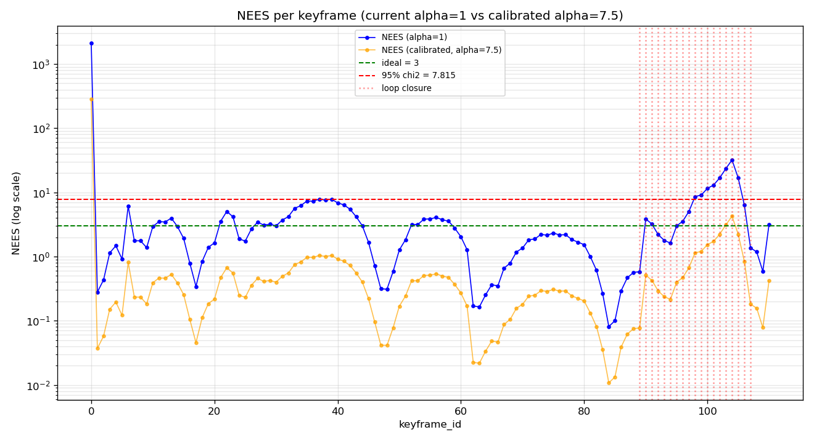

# drone-graph-slam

**A learning-driven, portfolio-grade drone Graph-SLAM system: a hand-written NDT
scan-to-scan front-end, a GTSAM factor-graph back-end (prior + `BetweenFactor` +
iSAM2), and NDT-verified loop closure — running in PX4 + Gazebo SITL.**

> Each section is tagged **`[DEMONSTRATED]`** (built and reproducible from a recorded
> bag), **`[DESIGNED]`** (specified, partially built), or **`[PLANNED]`** (future work),
> so "what works" is never blurred with "what's planned."
>
> **Honesty note up front:** on the evaluation bag, ground truth (`/ground_truth/pose`)
> and the EKF2 prior (`/odometry/ekf2`) both derive from the *same* PX4 `vehicle_odometry`.
> So the trajectory metrics below measure **consistency with PX4 EKF2**, not absolute
> accuracy. This caveat is repeated wherever a number appears — see
> [Limitations & honesty](#limitations--honesty).

---

## What this is `[DEMONSTRATED]`

A drone flies a fixed rectangular loop through a room (pillars + an inner wall) in PX4 +
Gazebo. From the LiDAR stream this project builds odometry and a globally-consistent
trajectory:

1. **NDT front-end** — we implement the Normal Distributions Transform ourselves (voxel
   Gaussians + Magnusson score + Newton optimization), **not** `pcl::NDT`. That is a
   deliberate engineering choice: writing the score ourselves gives direct access to the
   **cost Hessian**, which yields a clean per-measurement covariance `Σ_meas`.
2. **GTSAM back-end** — keyframes become graph nodes; compounded NDT odometry becomes
   `BetweenFactor<Pose3>` edges weighted by their propagated covariance; **iSAM2** solves
   incrementally.
3. **Loop closure** — when the drone revisits an earlier place, an NDT match between the
   two keyframe clouds (accepted only on a strong, well-conditioned score) adds a
   loop-closure `BetweenFactor`, and the graph corrects its accumulated drift.

The design goal is **depth of understanding** — NDT internals and graph SLAM — not raw
speed. Engineering order is fixed: **correctness → profiling → parallelization**; v1 is
single-threaded.

## Headline results `[DEMONSTRATED]`

All numbers below are from `bags/slam_loop_02` (see [Evaluation](#evaluation--results)).

| What it shows | Result |
|---|---|
| **Prior matters** — identity guess vs EKF2-prior initial guess (dead-reckoned NDT odometry) | ATE **8.56 m → 0.91 m**, ATE rotation **119.3° → 3.48°**; per-pair translation recovered **44% → 98%** |
| **Loop closure corrects drift** — 19 accepted closures | position error ‖est−GT‖ peak **1.39 m → 0.12 m** after the closure cluster; `map→odom` correction ‖t‖ ≈ 0.40 m |
| **Uncertainty behaves correctly** | Σ_post trace grows on the open chain, then **steps down ~5×** at the first loop closure |
| **Covariance is consistency-calibrated** | NEES 1306 → median **2.19** (ideal 3) after a scalar Σ_meas calibration (see [Limitations](#limitations--honesty)) |

> ⚠️ Ground truth = PX4 EKF2 (same source as the prior) on this bag, so **0.91 m is a
> best-case bound**, not standalone NDT accuracy.

---

## System architecture `[DEMONSTRATED]` core · `[DESIGNED]` full spec



Two design pillars:

- **The `graph_slam` core is flight-stack-agnostic.** It consumes only standard ROS
  messages (`sensor_msgs/PointCloud2`, `nav_msgs/Odometry`, `geometry_msgs`) and **never
  imports `px4_msgs`** (verified: zero PX4 includes in the core). All PX4 specifics —
  `px4_msgs` types, the **NED↔ENU** conversion, the **EKF2→prior** adapter, the
  **ground-truth bridge**, uXRCE-DDS — live in the separate `px4_offboard` package.
- **The covariance chain is explicit:** `Σ_meas` (one NDT match, from the cost Hessian [3]) →
  `Σ_prop` (compounded between keyframes via the SE(3) adjoint, following Barfoot &
  Furgale [4]) → `BetweenFactor` noise → `Σ_post` (graph posterior marginal, shrinks at
  loop closure).

---

## NDT front-end `[DEMONSTRATED]`

- **Voxel Gaussians:** the target cloud is partitioned into voxels; each stores a mean +
  covariance (a local Gaussian surface model).
- **Score + Newton:** we optimize the NDT objective with a Newton step, ourselves — the
  point of the project. The 2D formulation is Biber & Straßer [1]; the 3D score and its
  analytic gradient/Hessian we implement follow Magnusson [2]. The converged **cost
  Hessian** gives `Σ_meas ≈ s · H⁻¹`, the registration-covariance-from-cost idea of
  Censi [3].
- **Why custom, not `pcl::NDT`:** `pcl::NormalDistributionsTransform` does not expose the
  Hessian, so it cannot yield a principled `Σ_meas`. `pcl::NDT` is kept **only** as an
  optional benchmarking baseline (`PclNdtBaseline`), never in the pipeline.
- **EKF2 prior as an initial guess (NDT-08):** the relative motion composed from two EKF2
  poses seeds `align()`. It is a **seed, not a cost term** — NDT still refines it. This one
  change collapses dead-reckon drift (see headline A/B).



*Good alignment ⇒ blue (aligned source) overlaps green (target).*

---

## IMU & sensor fusion `[DEMONSTRATED]` (via EKF2, indirect) · `[PLANNED]` (preintegration)

> **Audited reality:** the `graph_slam` core does **not** consume raw IMU — there is no
> `ImuFactor`/preintegration anywhere in the graph. IMU is fused **upstream by PX4 EKF2**,
> and we consume that fused estimate *indirectly* as the NDT prior. (A
> `px4_offboard/imu_bridge.py` publishes `sensor_msgs/Imu`, but nothing in SLAM subscribes
> to it.)

- **What an IMU gives you:** a gyroscope (angular velocity) + accelerometer (specific
  force) at high rate (100s–1000s Hz). Integrated alone it dead-reckons — bias and noise
  accumulate, so pose drifts quickly. Strength: smooth, high-rate *short-term* motion.
  Weakness: unbounded long-term drift.
- **What "fusing" means:** combining the IMU with slower but drift-free / geometrically
  anchored measurements (LiDAR/NDT, GPS, vision) so each covers the other's weakness. Needs
  a probabilistic estimator that weights sources by uncertainty.
- **Two places fusion can happen — and which we use:**
  1. **Inside PX4 EKF2 (filtering).** EKF2 already fuses IMU + baro + GPS/vision + mag into
     one state. Feeding EKF2 odometry as the NDT prior consumes IMU-fused output
     **indirectly**. → *This is the demonstrated reality here.*
  2. **Inside the GTSAM graph via IMU preintegration (smoothing).** On-manifold
     preintegration (Forster et al. [8]) summarizes the many high-rate IMU samples between two keyframes into one
     relative-motion `ImuFactor` + covariance, with accel/gyro **biases as extra state**. →
     *This is `[PLANNED]` (ADV-01); it is not in the code.*
- **Filtering vs smoothing:** EKF2 is a *filter* (marginalizes the past, one state); GTSAM
  is a *smoother* (keeps keyframe states, re-linearizes) — the exact distinction this
  project embodies.

---

## GTSAM graph design `[DEMONSTRATED]`

- **Factors:** `PriorFactor` at bootstrap (first node), `BetweenFactor<Pose3>` between
  consecutive keyframes (noise = propagated `Σ_prop`), and a loop-closure `BetweenFactor`
  across revisits.
- **Optimizer:** **iSAM2** incremental solve via the Bayes tree (Kaess et al. [5]) using
  the GTSAM library [6, 7] (a batch Levenberg–Marquardt path is retained for offline sanity
  checks).
- **Keyframe policy (SLAM-01):** trigger on distance / angle / time thresholds (YAML),
  bounding graph growth.
- **Values vs graph:** factors live in a `NonlinearFactorGraph`; the current estimate lives
  in a separate `Values`; a loop closure adds a cross-edge between *existing* keyframes (no
  new `Values`).
- **Diagnostics:** on the open chain `chi2 ≈ 0` (a tree — correct, not a bug); it spikes
  when a loop constraint conflicts with accumulated drift, then the graph absorbs it. The
  quantity that genuinely grows with open-chain drift is the `Σ_post` position trace.

## Loop closure `[DEMONSTRATED]`

- **Candidate detection (SLAM-09):** current keyframe near a much older keyframe in the
  optimized estimate (distance/revisit based).
- **Verification (SLAM-10):** run our NDT between the two keyframe clouds; accept **only**
  on convergence + a strong fitness score + a well-conditioned Hessian (all 6 DOF
  constrained). A false closure corrupts the whole graph, so borderline candidates are
  rejected. On `slam_loop_02`: **19 closures accepted, 0 false positives**, scores
  −0.94 … −1.14.

---

## Evaluation & results `[DEMONSTRATED]`

> Reproduced from `bags/slam_loop_02`. **Ground truth = PX4 EKF2** on this bag (see
> [Limitations](#limitations--honesty)); metrics are consistency-with-EKF2.

### The prior makes the front-end track (identity guess vs EKF2 prior)

| Metric | Identity guess | EKF2 prior | Change |
|---|---|---|---|
| ATE translation | 8.559 m | **0.907 m** | 9.4× |
| ATE rotation | 119.3° | **3.48°** | 34× |
| RPE translation (δ=10) | 3.043 m | 0.509 m | 6.0× |
| Per-pair \|t\| recovered | 44.3% | **98.1%** | near-full |



*Dead-reckoned NDT odometry with the EKF2 prior as initial guess — it tracks the GT loop.
From an identity guess (no prior) the NDT increments are correctly **directed** but
**under-scaled** (~44% of true motion), so the path curls away and ATE blows up to 8.56 m —
a demonstrated diagnostic that motivates both the prior and the graph back-end.*

### Loop closure corrects drift, and uncertainty is consistent

| Error ‖est−GT‖ + ±2σ envelope | Σ_post uncertainty trace |
|---|---|
|  |  |

*Error peaks 1.39 m mid-flight and drops to 0.12 m after the loop-closure cluster; the
uncertainty trace grows on the open chain and steps down at each closure (red lines).*

| 2D Σ_post ellipses on the X-Y path | NEES consistency |
|---|---|
|  |  |

---

## Limitations & honesty `[DEMONSTRATED]`

- **(a) Ground truth = PX4 EKF2 (same source as the prior).** On `slam_loop_02`, both
  `/ground_truth/pose` and `/odometry/ekf2` derive from PX4 `vehicle_odometry`. So ATE/RPE
  measure **consistency with EKF2**, the prior ≈ the answer, and **0.91 m is a best-case
  bound**, not standalone NDT accuracy. An independent Gazebo model-state ground-truth bag
  is the planned fix.
- **(b) The front-end under-converges from an identity guess** (~44% of true translation).
  This is presented as a *demonstrated diagnostic finding* — and the motivation for the
  prior + graph — not hidden.
- **(c) `Σ_post` was overconfident.** The NDT Hessian measures cost-surface *curvature*,
  not true pose uncertainty, so raw `Σ_meas` is ~435× too tight — measured by the
  Normalized Estimation Error Squared (NEES) consistency test [9] (NEES 1306 vs ideal 3). A
  scalar `ndt_cov_scale_factor = 435` restores median NEES to ~2.2 and pulls error inside
  ±2σ, **but** it is a single scalar (residual anisotropy remains) **fit to this one bag,
  not cross-validated**. A principled per-axis / geometry-aware model is future work.
- **(d) Real-hardware and independent-GT accuracy are not yet demonstrated.**

---

## Build & run the pipeline `[DEMONSTRATED]`

### Prerequisites

Tested on (exact stack that produced the results):

| Component | Version |
|---|---|
| OS | Ubuntu 24.04.4 LTS |
| ROS 2 | Jazzy |
| Gazebo | Sim 8.11.0 (Harmonic) |
| PX4-Autopilot | `main` @ `v1.18.0-alpha1-265-g8ae02ec482` |
| Micro-XRCE-DDS Agent | installed (exact version not queried) |
| GTSAM | 4.3a1 (`/usr/local`) |
| PCL | 1.14.0 |
| Eigen3 | system (ROS 2 Jazzy) |
| C++ | 17 |

`px4_msgs` is **not vendored** in this repo — clone the branch matching your PX4 version
into the workspace `src/` (`git clone https://github.com/PX4/px4_msgs.git`, then check out
the branch/tag that matches your PX4; results here used PX4 `main`).

### Build & test (from the colcon workspace root `drone_ws/`)

```bash
colcon build
source install/setup.bash
colcon test --packages-select graph_slam && colcon test-result --verbose
```

### Run the full SLAM stack on a replay bag

```bash
# Terminal 1 — PX4 EKF2 → /odometry/ekf2 (ENU) adapter
ros2 launch px4_offboard ekf2_odometry_adapter.launch.py

# Terminal 2 — NDT front-end + GTSAM back-end (+ optional GT bridge for EVAL-05)
ros2 launch graph_slam graph_backend.launch.py rviz:=true
ros2 launch px4_offboard ground_truth_bridge.launch.py          # for loop-closure / covariance eval

# Terminal 3 — replay the canonical bag (NO --clock: recorded sim-time /clock drives use_sim_time)
ros2 bag play bags/slam_loop_02 --qos-profile-overrides-path bags/px4_qos_overrides.yaml
```

> The bag is **not committed** (large binary). Record your own `slam_loop_02` while
> `px4_offboard` flies the loop in SITL, or fetch it from the release assets / external
> link, then place it under `bags/`.

### Verify

```bash
ros2 topic hz /slam/graph_path       # ~4–6 Hz on replay
ros2 topic hz /slam/diagnostics      # JSON: chi2, marginal_cov_trace, loop_closure events
ros2 run tf2_ros tf2_echo map odom   # non-identity after loop closure
```

### Offline plots (Python / matplotlib, in `graph_slam/scripts/`)

```bash
python3 graph_slam/scripts/eval05_plot.py analysis/eval05_covariance_log.csv
python3 graph_slam/scripts/eval02_trajectory.py analysis/eval02_trajectory_prior.csv
```

---

## Observing in RViz `[DEMONSTRATED]`

Fixed frame `map`; add:

| Topic | Type | Shows |
|---|---|---|
| `/slam/graph_path` | `nav_msgs/Path` | optimized keyframe trajectory |
| `/slam/gt_path` | `nav_msgs/Path` | ground-truth path (EVAL-05) |
| `/slam/keyframes` | `MarkerArray` | keyframe spheres |
| `/slam/graph_edges` | `Marker` | odometry + loop edges |
| `/slam/covariance_ellipsoids` | `MarkerArray` | Σ_post ellipsoids (green → cyan on looped keyframes) |
| `/ndt_frontend/ndt_odom` | `nav_msgs/Odometry` | high-rate front-end odometry |

Good run: aligned scans overlap; the estimate path tracks GT; ellipsoids **shrink** at loop
closures. Drifting run: the path curls away from GT and ellipsoids keep growing.

**Frames (REP-105):** `map → odom → base_link → lidar_link`. `odom → base_link` is the
continuous NDT odometry (may drift, never jumps); `map → odom` is the graph correction
(jumps at loop closure).

---

## Compatibility (other flight stacks) `[not tested]`

The `graph_slam` core is flight-stack-agnostic (standard ROS messages only; never imports
`px4_msgs`). In principle another stack (e.g. **ArduPilot**) works by supplying the same
`nav_msgs/Odometry` prior + `sensor_msgs/PointCloud2` cloud + optional ground truth through
its own adapter — **but this is untested.** Expect convention/frame differences to matter:
NED↔ENU handling, MAVROS exposing ENU topics vs the raw PX4/NED path used here, EKF3
(ArduPilot) vs EKF2 (PX4), and topic-name/timing differences. Treat it as *"should be
adaptable; differences to watch,"* not *"supported."*

---

## Repository layout

```
drone-graph-slam/            # this repo (umbrella)
├── graph_slam/              # PX4-agnostic SLAM core (ament_cmake, C++17)
│   ├── include/graph_slam/  #   public headers: ndt/, graph/, loop/, eval/
│   ├── src/                 #   implementations + ROS2 nodes
│   ├── launch/  config/     #   launch files + slam_params.yaml
│   ├── scripts/             #   offline eval plots (Python/matplotlib)
│   └── test/                #   gtest + pytest
├── px4_offboard/            # PX4 glue: flight FSM, NED↔ENU, EKF2→prior, GT bridge
└── docs/figures/            # static result figures used by this README
```

`px4_msgs` (external), recorded `bags/`, and the internal design/story docs live **outside**
this repo.

---

## Roadmap `[PLANNED]`

- Independent ground truth (Gazebo model-state bag) → turns ATE into *absolute* accuracy.
- Principled `Σ_meas` calibration (per-axis / geometry-aware; cross-validated).
- IMU preintegration factor in the graph (ADV-01).
- Scan-to-map registration + local map (NDT-10 / SLAM-02).
- CI + graph persistence + demo (INFRA-03/04/05).
- Real-hardware flight.

## References

**NDT registration**
1. P. Biber and W. Straßer, "The Normal Distributions Transform: A New Approach to Laser
   Scan Matching," *IEEE/RSJ IROS*, 2003.
2. M. Magnusson, "The Three-Dimensional Normal-Distributions Transform — an Efficient
   Representation for Registration, Surface Analysis, and Loop Detection," PhD thesis,
   Örebro University, 2009. *(the 3D score + analytic gradient/Hessian this project
   implements)*
3. A. Censi, "An Accurate Closed-Form Estimate of ICP's Covariance," *IEEE ICRA*, 2007.
   *(registration covariance from the cost function — the `Σ_meas ≈ s·H⁻¹` idea)*

**Pose uncertainty on SE(3)**
4. T. D. Barfoot and P. T. Furgale, "Associating Uncertainty With Three-Dimensional Poses
   for Use in Estimation Problems," *IEEE Trans. Robotics*, 2014. *(compounding `Σ_prop` via
   the adjoint)*. See also T. D. Barfoot, *State Estimation for Robotics*, Cambridge Univ.
   Press, 2017.

**Factor-graph back-end (GTSAM / iSAM2)**
5. M. Kaess, H. Johannsson, R. Roberts, V. Ila, J. Leonard, and F. Dellaert, "iSAM2:
   Incremental Smoothing and Mapping Using the Bayes Tree," *Int. J. Robotics Research*,
   2012.
6. F. Dellaert and M. Kaess, "Factor Graphs for Robot Perception," *Foundations and Trends
   in Robotics*, 2017.
7. F. Dellaert, "Factor Graphs and GTSAM: A Hands-on Introduction," Georgia Tech Technical
   Report GT-RIM-CP&R-2012-002, 2012. Library: [GTSAM](https://gtsam.org).

**IMU preintegration (planned)**
8. C. Forster, L. Carlone, F. Dellaert, and D. Scaramuzza, "On-Manifold Preintegration for
   Real-Time Visual–Inertial Odometry," *IEEE Trans. Robotics*, 2017.

**Estimator consistency (NEES)**
9. Y. Bar-Shalom, X.-R. Li, and T. Kirubarajan, *Estimation with Applications to Tracking
   and Navigation*, Wiley, 2001. *(NEES / chi-square consistency test)*

**Standards & platform**
10. ROS REP-105, "Coordinate Frames for Mobile Platforms." · [PX4 Autopilot](https://px4.io)
    · [ROS 2 Jazzy](https://docs.ros.org/en/jazzy/).

## License

MIT — see [LICENSE](LICENSE).
