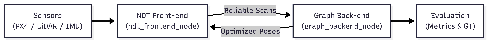
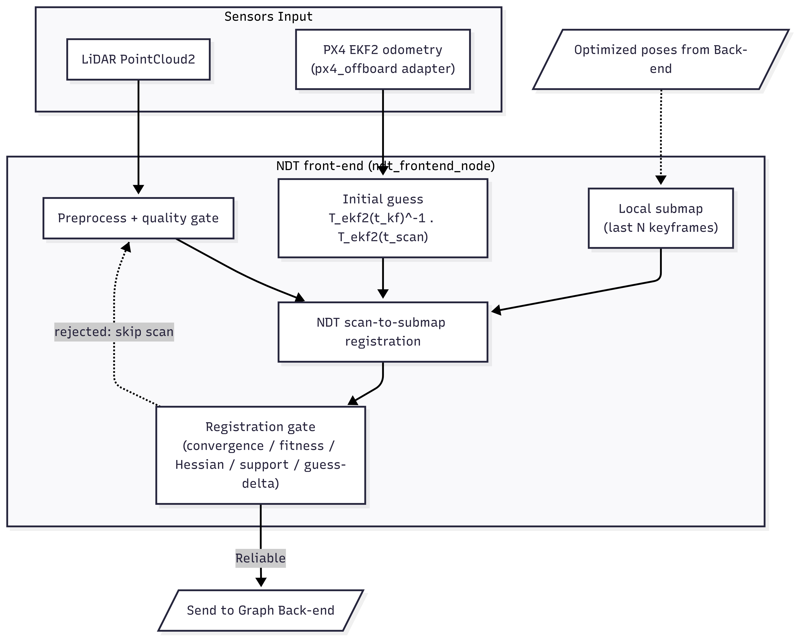
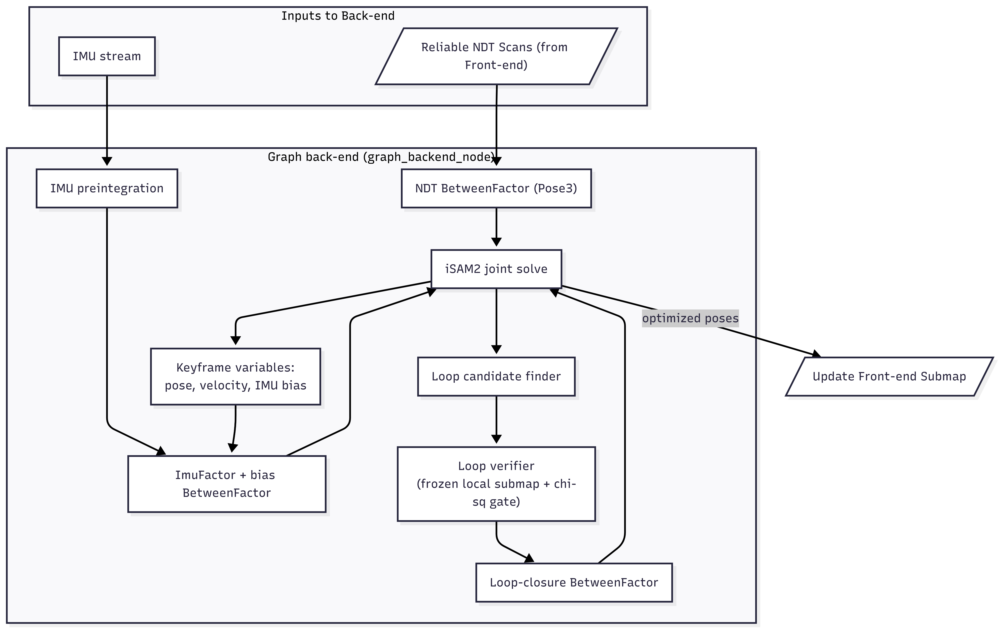
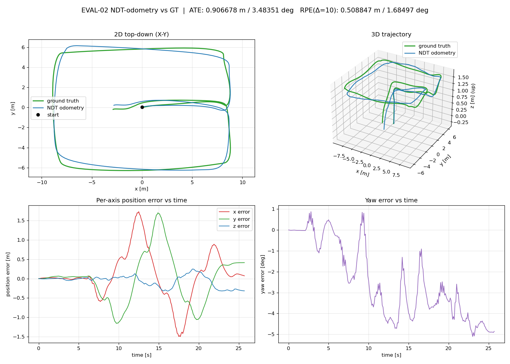
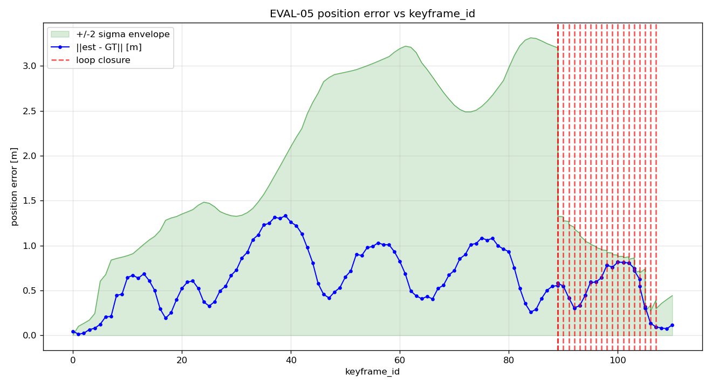
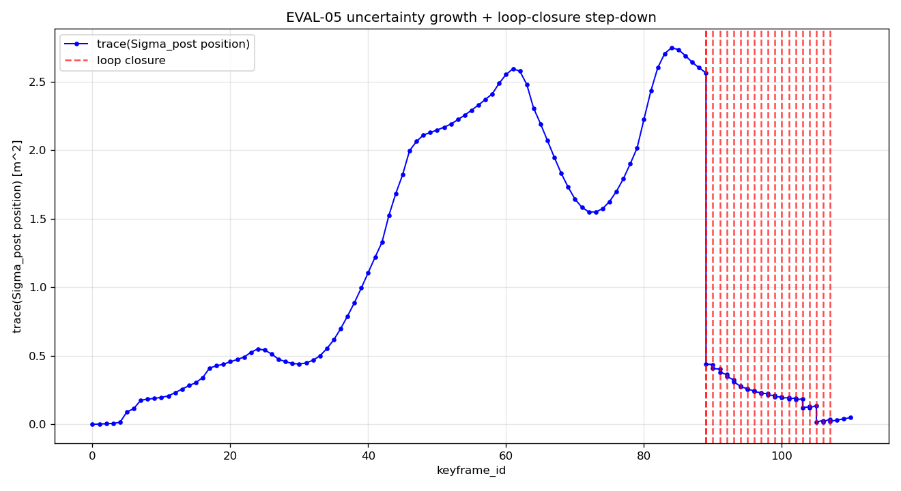
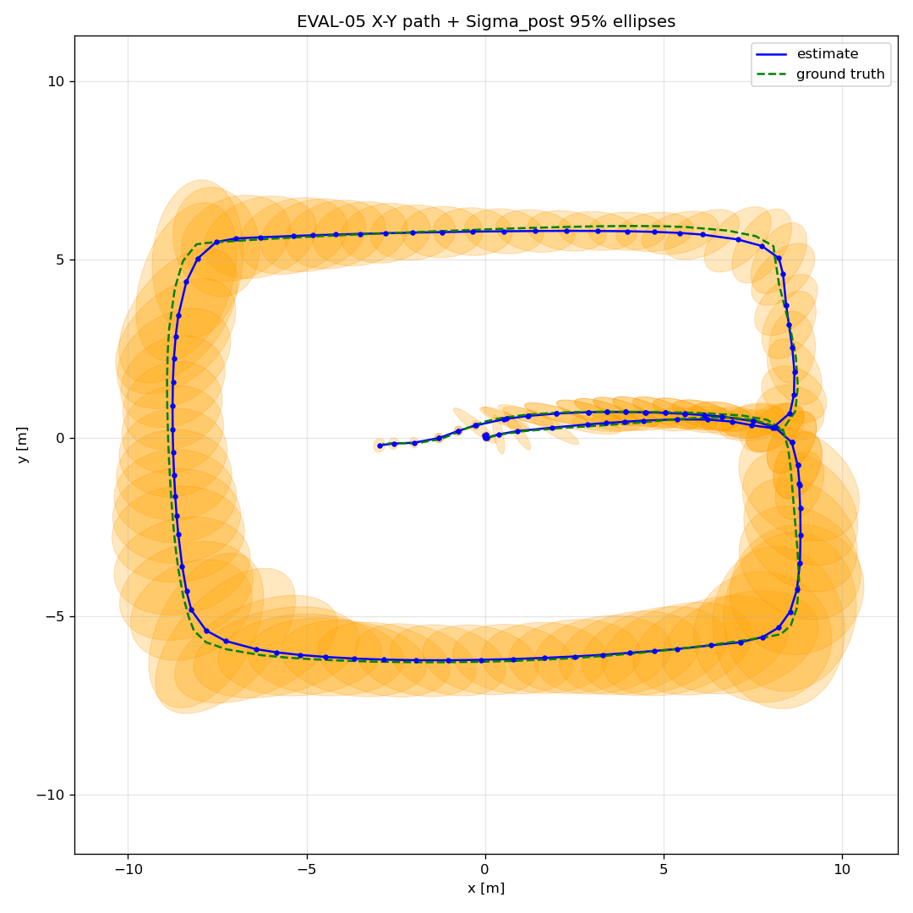
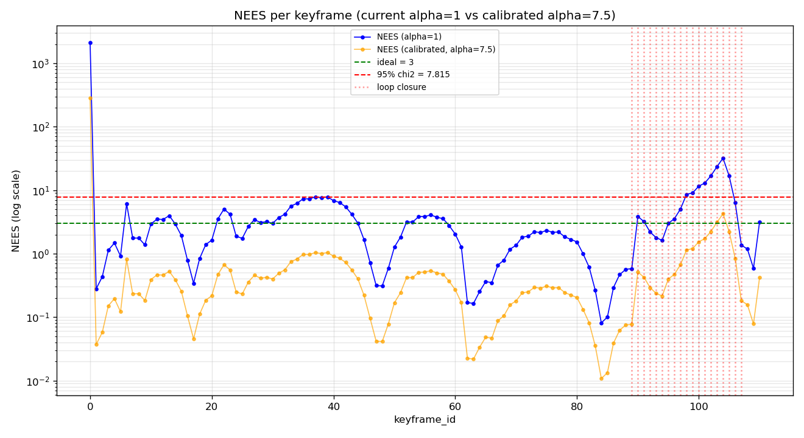

# drone-graph-slam

**A learning-driven, portfolio-grade drone Graph-SLAM system: a hand-written NDT
scan-to-scan front-end, a GTSAM factor-graph back-end (prior + `BetweenFactor` +
iSAM2), and NDT-verified loop closure — running in PX4 + Gazebo SITL.**

<p align="center">
  
</p>

<p align="center"><em>Live PX4 + Gazebo SITL — the x500 flies the room loop while the NDT front-end + GTSAM
back-end + loop closure build the graph in RViz.</em></p>

> Each section is tagged **`[DEMONSTRATED]`** (built and reproducible from a recorded
> bag), **`[DESIGNED]`** (specified, partially built), or **`[PLANNED]`** (future work),
> so "what works" is never blurred with "what's planned."
>
> **Honesty note up front:** on the evaluation bag, ground truth (`/ground_truth/pose`)
> and the EKF2 prior (`/odometry/ekf2`) both derive from the *same* PX4 `vehicle_odometry`.
> So the trajectory metrics below measure **consistency with PX4 EKF2**, not absolute
> accuracy. This caveat is repeated wherever a number appears — see
> [Limitations & honesty](#limitations--honesty).

---

## What this is `[DEMONSTRATED]`

A drone flies a fixed rectangular loop through a room (pillars + an inner wall) in PX4 +
Gazebo. From the LiDAR and IMU streams this project builds odometry and a
globally-consistent trajectory:

1. **NDT front-end** — we implement the Normal Distributions Transform ourselves (voxel
   Gaussians + Magnusson score + Newton optimization), **not** `pcl::NDT`. That is a
   deliberate engineering choice: writing the score ourselves gives direct access to the
   **cost Hessian**, which yields a clean per-measurement covariance `Σ_meas`. Each scan
   registers against a local **submap** — the last several keyframe clouds fused at their
   optimized poses — rather than a single previous scan, for a wider convergence basin and
   less accumulated drift.
2. **GTSAM back-end** — each keyframe is three graph variables: pose, velocity, and IMU
   sensor bias. Two independent constraints join consecutive keyframes: an **IMU
   preintegration factor** (`ImuFactor` + a separate bias-random-walk `BetweenFactor`,
   following LIO-SAM's factor structure) built from the raw IMU stream, and an NDT
   **`BetweenFactor<Pose3>`** from scan-to-submap registration, weighted by its propagated
   covariance. **iSAM2** solves the joint graph incrementally.
3. **Loop closure** — when the drone revisits an earlier place, an NDT match against a
   **frozen local submap** of that earlier place (accepted only on a strong,
   well-conditioned score, plus a statistical consistency check against the graph's own
   current uncertainty) adds a loop-closure `BetweenFactor`, and the graph corrects its
   accumulated drift.

The design goal is **depth of understanding** — NDT internals, IMU preintegration, and
graph SLAM — not raw speed. Engineering order is fixed: **correctness → profiling →
parallelization**; v1 is single-threaded.

## Headline results `[DEMONSTRATED]`

### Current pipeline — `bags/slam_loop_03`, independent ground truth

The shipped default configuration, full pipeline: EKF2-guided NDT scan-to-submap
front-end, joint IMU+NDT graph back-end, frozen-submap loop closure with its χ²
consistency gate — scored against ground truth read directly from the Gazebo
simulator's own model state, not from the flight controller's estimator (see
[Limitations](#limitations--honesty) for exactly which bags this applies to).

| What it shows | Result |
|---|---|
| **An independent initial guess matters** — PX4 EKF2 guess vs a guess anchored on the graph's own optimized state (both tested on the same fused IMU+NDT backbone) | XY ATE **0.099 m vs 3.308 m** (scan-to-scan, ≈33×, non-overlapping across 5 runs each); the graph-anchored guess free-runs on stale velocity during hovers until it leaves NDT's convergence basin — an independent source avoids that feedback loop entirely |
| **Full pipeline, default config** — 19 accepted loop closures over the ~76 m loop | ATE translation **0.085 m**, ATE rotation **0.85°**; only 1 of 357 LiDAR scans rejected end to end |
| **Loop closure shrinks uncertainty** | `Σ_post` position-block trace steps down **1.2×–7.1×** at each accepted closure (e.g. keyframe 90: 7.06×) |
| **Covariance is consistent, without re-tuning** | median NEES **3.60** (ideal ≈3) — using the same `ndt_cov_scale_factor` carried over from the previous architecture; see [Limitations](#limitations--honesty) for how this arose |

### Earlier milestone — `bags/slam_loop_02`, EKF2-derived ground truth

The numbers below predate the LiDAR-inertial redesign above (scan-to-scan NDT, no IMU
factor, pose-only graph) and are kept for history.

| What it shows | Result |
|---|---|
| **Prior matters** — identity guess vs EKF2-prior initial guess (dead-reckoned NDT odometry) | ATE **8.56 m → 0.91 m**, ATE rotation **119.3° → 3.48°**; per-pair translation recovered **44% → 98%** |
| **Loop closure corrects drift** — 19 accepted closures | position error ‖est−GT‖ peak **1.39 m → 0.12 m** after the closure cluster; `map→odom` correction ‖t‖ ≈ 0.40 m |
| **Uncertainty behaves correctly** | Σ_post trace grows on the open chain, then **steps down ~5×** at the first loop closure |
| **Covariance is consistency-calibrated** | NEES 1306 → median **2.19** (ideal 3) after a scalar Σ_meas calibration |

> ⚠️ Ground truth = PX4 EKF2 (same source as the prior) on this bag, so **0.91 m is a
> best-case bound**, not standalone NDT accuracy.

---

## System architecture `[DEMONSTRATED]` core · `[DESIGNED]` full spec



Two design pillars:

- **The `graph_slam` core is flight-stack-agnostic.** It consumes only standard ROS
  messages (`sensor_msgs/PointCloud2`, `sensor_msgs/Imu`, `nav_msgs/Odometry`,
  `geometry_msgs`) and **never imports `px4_msgs`** (verified: zero PX4 includes in the
  core). All PX4 specifics — `px4_msgs` types, the **NED↔ENU** conversion, the
  **EKF2→guess** adapter, the ground-truth bridges, uXRCE-DDS — live in the separate
  `px4_offboard` package.
- **The covariance chain is explicit, on both inputs to the joint graph.** For NDT:
  `Σ_meas` (one match, from the cost Hessian [3]) → `Σ_prop` (compounded via the SE(3)
  adjoint, following Barfoot & Furgale [4]) → `BetweenFactor` noise. For IMU: GTSAM's
  native preintegration covariance, propagated over the interval between two keyframes.
  Both feed the same iSAM2 solve, producing one posterior marginal `Σ_post` per node —
  which shrinks at loop closure.

---

## NDT front-end `[DEMONSTRATED]`

- **Voxel Gaussians:** the target cloud is partitioned into voxels; each stores a mean +
  covariance (a local Gaussian surface model).
- **Score + Newton:** we optimize the NDT objective with a Newton step, ourselves — the
  point of the project. The 2D formulation is Biber & Straßer [1]; the 3D score and its
  analytic gradient/Hessian we implement follow Magnusson [2]. The converged **cost
  Hessian** gives `Σ_meas ≈ s · H⁻¹`, the registration-covariance-from-cost idea of
  Censi [3].
- **Why custom, not `pcl::NDT`:** `pcl::NormalDistributionsTransform` does not expose the
  Hessian, so it cannot yield a principled `Σ_meas`. `pcl::NDT` is kept **only** as an
  optional benchmarking baseline (`PclNdtBaseline`), never in the pipeline.
- **PX4 EKF2 as the initial guess:** the NDT initial guess is a relative transform
  composed from two EKF2 samples, `T_guess = T_ekf2(t_keyframe)⁻¹ · T_ekf2(t_scan)`,
  looked up by message header stamp. It is a **seed, not a cost term** — NDT still
  refines it — and only the *difference* between two nearby EKF2 poses is used, so
  EKF2's own drift cancels rather than accumulating. EKF2 runs entirely inside PX4
  firmware and never consumes any `graph_slam` output, so it stays an independent
  source, outside the graph's own feedback loop. This is the same mechanism validated
  pre-redesign (identity guess vs. EKF2 guess, ATE 8.56 m → 0.91 m — see the
  earlier-milestone table under [Headline results](#headline-results)); it still holds
  on the current backbone, and additionally avoids a feedback-loop failure mode a
  graph-anchored guess was measured to have (see [Headline results](#headline-results)).
- **Scan-to-submap matching:** each scan aligns against a small local map, not the
  single previous scan — the last several keyframe clouds, transformed into one common
  frame, merged, and voxel-downsampled. This widens the convergence basin and
  measurably improves both drift and robustness to rejected scans during slow or
  hovering flight.

---

## IMU & sensor fusion `[DEMONSTRATED]`

The `graph_slam` core now consumes raw IMU directly: every keyframe carries pose,
velocity, and IMU bias as graph variables, and an IMU preintegration factor is one of
the two independent constraints between consecutive keyframes (the other is NDT — see
[GTSAM graph design](#gtsam-graph-design)). PX4 EKF2 is still used, but only as an
independent seed for the NDT registration's initial guess (see
[NDT front-end](#ndt-front-end)) — it is not fused into the graph.

- **What an IMU gives you:** a gyroscope (angular velocity) + accelerometer (specific
  force) at high rate (100s–1000s Hz). Integrated alone it dead-reckons — bias and noise
  accumulate, so pose drifts quickly. Strength: smooth, high-rate *short-term* motion.
  Weakness: unbounded long-term drift.
- **What "fusing" means:** combining the IMU with slower but drift-free / geometrically
  anchored measurements (LiDAR/NDT, GPS, vision) so each covers the other's weakness. Needs
  a probabilistic estimator that weights sources by uncertainty.
- **Two places fusion can happen — we now use both, for different jobs:**
  1. **Inside PX4 EKF2 (filtering).** EKF2 fuses IMU + baro + GPS/vision + mag into one
     state upstream, entirely outside `graph_slam`. We consume its output only as a
     *seed* for NDT's initial guess — an independent source that never touches the
     graph's own estimate.
  2. **Inside the GTSAM graph via IMU preintegration (smoothing).** On-manifold
     preintegration (Forster et al. [8]) summarizes the many high-rate IMU samples
     between two keyframes into one relative-motion `ImuFactor`, plus a **separate**
     factor modeling accelerometer/gyroscope **bias** as a slow random walk (LIO-SAM's
     factor structure, not GTSAM's combined-factor variant). This is the graph's actual
     IMU fusion mechanism, jointly optimized against the independent NDT measurement on
     every keyframe.
- **Filtering vs smoothing:** EKF2 is a *filter* (marginalizes the past, one state); GTSAM
  is a *smoother* (keeps keyframe states, re-linearizes). Both are demonstrated here, at
  different points in the pipeline — EKF2 seeds registration, GTSAM performs the sensor
  fusion that actually produces the trajectory and its uncertainty.
- **Noise model:** the preintegration and bias-random-walk noise densities come from a
  published LIO-SAM reference tuning for this vehicle/sensor combination, kept fixed
  rather than fit to this project's own bags — so any future head-to-head comparison
  against LIO-SAM stays controlled on the same inputs.

---

## GTSAM graph design `[DEMONSTRATED]`

- **Node model:** each keyframe is three GTSAM variables — pose (`Pose3`), velocity
  (`Vector3`), and IMU bias (`imuBias::ConstantBias`) — rather than pose alone.
- **Factors, per keyframe:**
  - Bootstrap (first node only): three `PriorFactor`s — pose (tight, at the first
    NDT-odometry pose), velocity (near-zero, bags start at rest), bias (zero-mean).
  - `ImuFactor` — pose+velocity constraint from the preintegrated IMU measurement
    between two keyframes. Unconditional: added on every keyframe by default.
  - A separate bias `BetweenFactor` — models accelerometer/gyroscope bias as a slow
    random walk, noise scaled by the elapsed time between keyframes.
  - NDT `BetweenFactor<Pose3>` — from scan-to-submap registration, noise = the
    propagated, Hessian-derived `Σ_prop`. Independent of the IMU factor: added only
    when NDT converges and passes its gate, and constrains pose only (not
    velocity/bias).
  - Loop closure `BetweenFactor<Pose3>` — added across a revisit once accepted (see
    [Loop closure](#loop-closure)); optionally wrapped in a Huber robust kernel.
- **Optimizer:** **iSAM2** incremental solve via the Bayes tree (Kaess et al. [5]) using
  the GTSAM library [6, 7] (a batch Levenberg–Marquardt path is retained for offline
  sanity checks).
- **Keyframe policy:** trigger on distance / angle / time thresholds (YAML), bounding
  graph growth.
- **Values vs graph:** factors live in a `NonlinearFactorGraph`; the current estimate
  lives in a separate `Values`; a loop closure adds a cross-edge between *existing*
  keyframes (no new `Values`).
- **Diagnostics:** per-edge chi² is logged for the IMU factor and the NDT factor
  separately, so a mis-weighted or diverging sensor is visible before it corrupts the
  estimate. The quantity that genuinely tracks open-chain drift is the `Σ_post`
  position trace, which now reflects uncertainty from both sensors jointly.

## Loop closure `[DEMONSTRATED]`

- **Candidate detection:** current keyframe near a much older keyframe in the optimized
  estimate (distance/revisit based).
- **Verification target:** NDT is run against a **frozen local submap** built by fusing
  a small window of keyframe clouds around the candidate match (at their current
  backend-optimized poses), not a single keyframe cloud — the same reasoning as the
  front-end's scan-to-submap matching: more support, a wider convergence basin.
- **Acceptance gates, all must pass:** convergence, a strong fitness score, a
  well-conditioned Hessian (all 6 DOF constrained), **and** a chi-square consistency
  check — the loop measurement's implied pose for the revisited keyframe is compared
  against that keyframe's own current pose-graph uncertainty; a statistically
  inconsistent match is rejected before it can enter the graph. Accepted factors are
  wrapped in a Huber robust kernel, so even a marginal-but-accepted match cannot swing
  the optimizer as hard as a clean one.
- **Why this gate is on by default** (unlike the analogous odometry-edge gate — see
  [Keyframe & factor decision flow](#keyframe--factor-decision-flow)): rejecting a loop
  candidate is risk-free. The graph simply continues without that edge, same as any
  other rejection reason, with no risk of leaving a node under-constrained the way
  dropping an odometry edge can.
- **Measured on `slam_loop_03`:** the frozen-submap target alone improved ATE ~7%
  translation / ~23% rotation over a single keyframe cloud; adding the chi-square gate
  improved it further to ~14% / ~28%, while closure count held (18–19) and consistency
  stayed near-ideal (median NEES ~3.6). On this bag the gate never had to reject a
  candidate — the earlier fitness/Hessian gates already screen effectively — so its
  reject/inflate behavior is verified by unit test rather than an observed rejection.

---

## Keyframe & factor decision flow `[DEMONSTRATED]`

How a raw LiDAR scan becomes (or does not become) a graph node and a factor — with the
real gates, thresholds, and fallbacks from the code. Note the **two keyframe layers**:
the front-end keeps a *registration* keyframe (the current submap window), while the
back-end keeps the *graph* keyframe (a GTSAM node). They use different thresholds.

**NDT front-end — per LiDAR scan (`ndt_frontend_node`):**



**GTSAM back-end — per reliable scan (`graph_backend_node`):**



**Gates, thresholds & fallbacks (defaults from `config/slam_params.yaml`, all tunable):**

| Stage | Rule | Effect |
|---|---|---|
| Input quality gate | `points ≥ 100` AND `spread_eigenvalue ≥ 0.1` | **hard-drops** the scan before NDT runs |
| Front-end keyframe/emit gate | `moved ≥ 0.3 m` OR `turned ≥ 5°` | scan-to-keyframe: only emit odom + advance the submap window on enough motion |
| Initial guess | `T_guess = T_ekf2(t_keyframe)⁻¹ · T_ekf2(t_scan)`, nearest-stamp lookup | seeds NDT; a stale/missing EKF2 sample degrades to an identity guess |
| Registration gate | convergence AND fitness AND well-conditioned Hessian AND enough scored support (`≥30%` of points) AND NDT result close to the guess (`≤0.5 m` translation / `≤~10°` rotation, skipped when no EKF2 sample was available) | any failure → **skip this scan entirely, publish no odometry** (no fallback substitution) |
| Σ_meas | `Σ_meas = 435 · H⁻¹` from the cost Hessian | per-measurement covariance; see [Limitations](#limitations--honesty) for how this scale factor's validity has evolved |
| Σ_meas degenerate fallback | `cond > 1e6` OR `min_eig ≤ 0` | replace with `diag(σrot=0.01 rad, σt=0.1 m)` → down-weights ambiguous geometry instead of dropping it |
| Bootstrap | first node: pose/velocity/bias `PriorFactor`s (pose σ=0.001 at the first NDT-odom pose, velocity σ=0.1 m/s at zero, bias σ=0.1 m/s² accel / 0.01 rad/s gyro at zero) | anchors the graph |
| Back-end keyframe policy | `accum ≥ 0.5 m` OR `≥ 0.5 rad` OR `≥ 10 s` (OR semantics; a non-positive threshold disables that criterion) | triggers a new graph node |
| IMU factor | unconditional per keyframe when IMU samples cover the interval | `ImuFactor` + bias `BetweenFactor`, from preintegration; falls back to weak scaffolding priors (no IMU constraint) if the interval has no usable samples |
| NDT odometry factor | added when NDT converges and passes its gate | `BetweenFactor<Pose3>`, noise = compounded `Σ_prop`; an optional chi-square consistency check against the IMU-predicted pose exists but is **off by default** — strict rejection was measured to cascade (3D ATE 0.11 m → 1.2–5.0 m on the test bag) when a dropped edge leaves a stretch constrained by IMU alone |
| Loop candidate | revisit `< 2.0 m` AND match `≥ 10` keyframes older | proposes a closure |
| Loop verify | converged AND `score ≤ -0.8` AND well-conditioned (`min_eig ≥ 1e-6`, `cond ≤ 1e4`) AND chi-square consistent against a frozen local submap (**on by default**) | accept → cross-edge + re-optimize; reject → untouched; one closure per keyframe |

## Evaluation & results `[DEMONSTRATED]`

### Current pipeline — `bags/slam_loop_03`, independent ground truth

Same configuration and ground truth as the current [Headline results](#headline-results).
Plots for this configuration have not been regenerated yet — the table below is the full
extent of what's currently reproducible; treat any visual for this bag as **NEEDS RE-RUN**
until `scripts/eval05_plot.py` is re-run against it.

| Metric | Value |
|---|---|
| ATE translation | **0.085 m** |
| ATE rotation | **0.85°** |
| Loop closures accepted | 19 |
| Front-end scans rejected | 1 / 357 |
| Median NEES (ideal ≈3) | **3.60** |
| Σ_post step-down at accepted closures | 1.2×–7.1× (e.g. keyframe 90: 7.06×) |

### Earlier milestone — `bags/slam_loop_02`, EKF2-derived ground truth

> Ground truth = PX4 EKF2 on this bag (see [Limitations](#limitations--honesty));
> metrics below are consistency-with-EKF2, not standalone accuracy.

#### The prior makes the front-end track (identity guess vs EKF2 prior)

| Metric | Identity guess | EKF2 prior | Change |
|---|---|---|---|
| ATE translation | 8.559 m | **0.907 m** | 9.4× |
| ATE rotation | 119.3° | **3.48°** | 34× |
| RPE translation (δ=10) | 3.043 m | 0.509 m | 6.0× |
| Per-pair \|t\| recovered | 44.3% | **98.1%** | near-full |



*Dead-reckoned NDT odometry with the EKF2 prior as initial guess — it tracks the GT loop.
From an identity guess (no prior) the NDT increments are correctly **directed** but
**under-scaled** (~44% of true motion), so the path curls away and ATE blows up to 8.56 m —
a demonstrated diagnostic that motivates both the prior and the graph back-end.*

#### Loop closure corrects drift, and uncertainty is consistent

| Error ‖est−GT‖ + ±2σ envelope | Σ_post uncertainty trace |
|---|---|
|  |  |

*Error peaks 1.39 m mid-flight and drops to 0.12 m after the loop-closure cluster; the
uncertainty trace grows on the open chain and steps down at each closure (red lines).*

| 2D Σ_post ellipses on the X-Y path | NEES consistency |
|---|---|
|  |  |

---

## Limitations & honesty `[DEMONSTRATED]`

- **(a) Ground truth on the older milestone bag was EKF2 (same source as the prior).**
  On `slam_loop_02`, both `/ground_truth/pose` and `/odometry/ekf2` derive from PX4
  `vehicle_odometry`, so ATE/RPE there measure **consistency with EKF2**, not standalone
  accuracy — that caveat still applies to every number quoted from that bag.
  **`slam_loop_03`** (and a second bag recorded later) now carry an **independent**
  ground truth — Gazebo's own simulator model-state pose, read directly and never
  touching PX4's estimator — so numbers from those bags are validated against a
  reference the estimator cannot see, not merely self-consistent with its own prior.
- **(b) The front-end under-converges from an identity guess** (~44% of true translation,
  measured pre-redesign on `slam_loop_02`). This is a *demonstrated diagnostic finding* —
  the motivation for using an independent initial guess at all — not hidden.
- **(c) The measurement-covariance scale factor is old, unvalidated on the current
  pipeline, and was not usefully re-calibrated.** `ndt_cov_scale_factor = 435` was
  originally fit on the pre-redesign, scan-to-scan, pose-only chain (NEES 1306 → median
  2.19 on `slam_loop_02`) and is explicitly not re-validated for the current
  LiDAR-inertial graph. Two things happened since: (1) a timing bug in how the IMU
  preintegration window was cut (against callback arrival time instead of the actual
  message timestamp) was found and fixed; with **435 left completely unchanged**, that
  fix alone brought the fused graph's median NEES from ~239 (badly overconfident) down
  to **~3.6** (ideal ≈3) on `slam_loop_03` — consistency improved as a side effect of a
  correctness fix, not a deliberate re-tune. (2) A deliberate joint recalibration was
  also attempted — sweeping the IMU noise densities together with the NDT scale factor,
  scored by NEES and 95% coverage. A candidate that looked better on the calibration bag
  came out **underconfident** on a second, independent-ground-truth bag and was **not
  shipped** — `ndt_cov_scale_factor` remains 435 in production. A single scalar, fit or
  validated on only one bag, is not a reliable calibration; this needs repeat runs
  across multiple independent-GT bags before it can be trusted.
- **(d) Independent-ground-truth accuracy is now demonstrated in simulation; real-hardware
  accuracy is not.** `slam_loop_03` and a second bag give trajectory metrics against a
  reference the estimator never sees, closing part of caveat (a) above — but only in
  Gazebo. No flight on real hardware has been run or evaluated.

---

## Build & run the pipeline `[DEMONSTRATED]`

### Prerequisites

Tested on (exact stack that produced the results):

| Component | Version |
|---|---|
| OS | Ubuntu 24.04.4 LTS |
| ROS 2 | Jazzy |
| Gazebo | Sim 8.11.0 (Harmonic) |
| PX4-Autopilot | `main` @ `v1.18.0-alpha1-265-g8ae02ec482` |
| Micro-XRCE-DDS Agent | installed (exact version not queried) |
| GTSAM | 4.3a1 (`/usr/local`) |
| PCL | 1.14.0 |
| Eigen3 | system (ROS 2 Jazzy) |
| C++ | 17 |

`px4_msgs` is **not vendored** in this repo — clone the branch matching your PX4 version
into the workspace `src/` (`git clone https://github.com/PX4/px4_msgs.git`, then check out
the branch/tag that matches your PX4; results here used PX4 `main`).

### Build & test (from the colcon workspace root `drone_ws/`)

```bash
colcon build
source install/setup.bash
colcon test --packages-select graph_slam && colcon test-result --verbose
```

### Run the full SLAM stack on a replay bag

```bash
# Terminal 1 — PX4 EKF2 → /odometry/ekf2 (ENU) adapter
ros2 launch px4_offboard ekf2_odometry_adapter.launch.py

# Terminal 2 — NDT front-end + GTSAM back-end (+ optional GT bridge for EVAL-05)
ros2 launch graph_slam graph_backend.launch.py rviz:=true
ros2 launch px4_offboard ground_truth_bridge.launch.py          # for loop-closure / covariance eval

# Terminal 3 — replay the canonical bag (NO --clock: recorded sim-time /clock drives use_sim_time)
ros2 bag play bags/slam_loop_02 --qos-profile-overrides-path bags/px4_qos_overrides.yaml
```

> The bag is **not committed** (large binary). Record your own `slam_loop_02` while
> `px4_offboard` flies the loop in SITL, or fetch it from the release assets / external
> link, then place it under `bags/`.

### Verify

```bash
ros2 topic hz /slam/graph_path       # ~4–6 Hz on replay
ros2 topic hz /slam/diagnostics      # JSON: chi2, marginal_cov_trace, loop_closure events
ros2 run tf2_ros tf2_echo map odom   # non-identity after loop closure
```

### Offline plots (Python / matplotlib, in `graph_slam/scripts/`)

```bash
python3 graph_slam/scripts/eval05_plot.py analysis/eval05_covariance_log.csv
python3 graph_slam/scripts/eval02_trajectory.py analysis/eval02_trajectory_prior.csv
```

---

## Live SITL demo (no bag) `[DEMONSTRATED]`

Run the whole stack live against PX4 SITL + Gazebo (instead of replaying a bag) — this is
what produces a real-time RViz view of the graph growing and snapping at loop closure, for a
screen recording. **Every ROS terminal first sources the overlay:**

```bash
source /opt/ros/jazzy/setup.bash
source ~/portfolio_ws/drone_ws/install/setup.bash
```

Requires PX4-Autopilot with the `x500_lidar_down` model + `my_slam_world` world, the
Micro-XRCE-DDS Agent, and `ros_gz_bridge`.

**0. Build once**
```bash
cd ~/portfolio_ws/drone_ws
colcon build && source install/setup.bash
```

**1. Terminal 1 — Micro-XRCE-DDS Agent** *(start before PX4)*
```bash
MicroXRCEAgent udp4 -p 8888
```

**2. Terminal 2 — PX4 SITL + Gazebo** (room world, 3D-LiDAR x500)
```bash
cd ~/PX4-Autopilot
PX4_GZ_WORLD=my_slam_world make px4_sitl gz_x500_lidar_down
```
Wait for EKF2 to converge, then in the same PX4 shell (`pxh>`) relax the arming checks so an
RC-/GCS-less offboard flight can arm — **SITL demo only; never disable these for real flight:**
```bash
param set NAV_DLL_ACT 0      # no GCS-datalink failsafe -> clears "No connection to the GCS"
param set COM_RCL_EXCEPT 4   # allow Offboard without RC
```

**3. Terminal 3 — Gazebo -> ROS bridge** (LiDAR + clock)
```bash
ros2 run ros_gz_bridge parameter_bridge \
  /x500/lidar_3d/points@sensor_msgs/msg/PointCloud2[gz.msgs.PointCloudPacked \
  /clock@rosgraph_msgs/msg/Clock[gz.msgs.Clock
# verify: ros2 topic hz /x500/lidar_3d/points   -> ~10 Hz
```

**4. Terminal 4 — PX4 -> ROS bridges** (EKF2 prior + ground truth)
```bash
ros2 launch px4_offboard ekf2_odometry_adapter.launch.py &
ros2 launch px4_offboard ground_truth_bridge.launch.py
```

**5. Terminal 5 — RViz** (SLAM view — the window to record)
```bash
rviz2 -d ~/portfolio_ws/drone_ws/src/drone-graph-slam/graph_slam/config/drone_graph_slam_sim.rviz \
      --ros-args -p use_sim_time:=true
```

**6. Terminal 6 — SLAM stack** (NDT front-end + GTSAM back-end)
```bash
ros2 launch graph_slam graph_backend.launch.py
# verify: ros2 topic hz /slam/graph_path
```

**7. Terminal 7 — Fly the mission** *(last — drives the whole pipeline)*
```bash
ros2 run px4_offboard offboard_control
```
Arms -> takes off -> flies the rectangular loop -> lands. In RViz the graph grows, GT vs
estimate paths draw, and the loop closure snaps the trajectory + shrinks the covariance
ellipsoids as the drone returns near the start.

> **Order matters:** 1 → 2 (EKF2 ready + params) → 3 → 4 → 5/6 → 7. The agent starts before
> PX4; `offboard_control` runs last. Shut down with Ctrl-C in reverse order; a stray Gazebo
> may need `pkill -9 -f 'gz sim'`.

---

## Observing in RViz `[DEMONSTRATED]`

Fixed frame `map`; add:

| Topic | Type | Shows |
|---|---|---|
| `/slam/graph_path` | `nav_msgs/Path` | optimized keyframe trajectory |
| `/slam/gt_path` | `nav_msgs/Path` | ground-truth path (EVAL-05) |
| `/slam/keyframes` | `MarkerArray` | keyframe spheres |
| `/slam/graph_edges` | `Marker` | odometry + loop edges |
| `/slam/covariance_ellipsoids` | `MarkerArray` | Σ_post ellipsoids (green → cyan on looped keyframes) |
| `/ndt_frontend/ndt_odom` | `nav_msgs/Odometry` | high-rate front-end odometry |

Good run: aligned scans overlap; the estimate path tracks GT; ellipsoids **shrink** at loop
closures. Drifting run: the path curls away from GT and ellipsoids keep growing.

**Frames (REP-105):** `map → odom → base_link → lidar_link`. `odom → base_link` is the
continuous NDT odometry (may drift, never jumps); `map → odom` is the graph correction
(jumps at loop closure).

---

## Compatibility (other flight stacks) `[not tested]`

The `graph_slam` core is flight-stack-agnostic (standard ROS messages only; never imports
`px4_msgs`). In principle another stack (e.g. **ArduPilot**) works by supplying the same
`nav_msgs/Odometry` prior + `sensor_msgs/PointCloud2` cloud + optional ground truth through
its own adapter — **but this is untested.** Expect convention/frame differences to matter:
NED↔ENU handling, MAVROS exposing ENU topics vs the raw PX4/NED path used here, EKF3
(ArduPilot) vs EKF2 (PX4), and topic-name/timing differences. Treat it as *"should be
adaptable; differences to watch,"* not *"supported."*

---

## Repository layout

```
drone-graph-slam/            # this repo (umbrella)
├── graph_slam/              # PX4-agnostic SLAM core (ament_cmake, C++17)
│   ├── include/graph_slam/  #   public headers: ndt/, graph/, loop/, eval/
│   ├── src/                 #   implementations + ROS2 nodes
│   ├── launch/  config/     #   launch files + slam_params.yaml
│   ├── scripts/             #   offline eval plots (Python/matplotlib)
│   └── test/                #   gtest + pytest
├── px4_offboard/            # PX4 glue: flight FSM, NED↔ENU, EKF2→prior, GT bridge
└── docs/figures/            # static result figures used by this README
```

`px4_msgs` (external), recorded `bags/`, and the internal design/story docs live **outside**
this repo.

---

## Roadmap `[PLANNED]`

- Calibrate the measurement-noise scale (and IMU noise densities) jointly, validated
  across multiple independent-ground-truth bags with repeats — a single scalar fit to
  one bag was found to not generalize to a second.
- Tune the local submap window size — shipped at a fixed 8 keyframes, never swept for
  its accuracy/robustness trade-off.
- A recovery policy after a rejected LiDAR registration — today a rejected scan is
  simply skipped (no odometry published for it) rather than substituted or retried.
- A keyframe-spawn trigger based on rising inertial uncertainty during a long hold, in
  addition to the existing distance/angle/time triggers.
- CI + graph persistence + demo.
- Real-hardware flight.

## References

**NDT registration**
1. P. Biber and W. Straßer, "The Normal Distributions Transform: A New Approach to Laser
   Scan Matching," *IEEE/RSJ IROS*, 2003.
2. M. Magnusson, "The Three-Dimensional Normal-Distributions Transform — an Efficient
   Representation for Registration, Surface Analysis, and Loop Detection," PhD thesis,
   Örebro University, 2009. *(the 3D score + analytic gradient/Hessian this project
   implements)*
3. A. Censi, "An Accurate Closed-Form Estimate of ICP's Covariance," *IEEE ICRA*, 2007.
   *(registration covariance from the cost function — the `Σ_meas ≈ s·H⁻¹` idea)*

**Pose uncertainty on SE(3)**
4. T. D. Barfoot and P. T. Furgale, "Associating Uncertainty With Three-Dimensional Poses
   for Use in Estimation Problems," *IEEE Trans. Robotics*, 2014. *(compounding `Σ_prop` via
   the adjoint)*. See also T. D. Barfoot, *State Estimation for Robotics*, Cambridge Univ.
   Press, 2017.

**Factor-graph back-end (GTSAM / iSAM2)**
5. M. Kaess, H. Johannsson, R. Roberts, V. Ila, J. Leonard, and F. Dellaert, "iSAM2:
   Incremental Smoothing and Mapping Using the Bayes Tree," *Int. J. Robotics Research*,
   2012.
6. F. Dellaert and M. Kaess, "Factor Graphs for Robot Perception," *Foundations and Trends
   in Robotics*, 2017.
7. F. Dellaert, "Factor Graphs and GTSAM: A Hands-on Introduction," Georgia Tech Technical
   Report GT-RIM-CP&R-2012-002, 2012. Library: [GTSAM](https://gtsam.org).

**IMU preintegration**
8. C. Forster, L. Carlone, F. Dellaert, and D. Scaramuzza, "On-Manifold Preintegration for
   Real-Time Visual–Inertial Odometry," *IEEE Trans. Robotics*, 2017.

**Estimator consistency (NEES)**
9. Y. Bar-Shalom, X.-R. Li, and T. Kirubarajan, *Estimation with Applications to Tracking
   and Navigation*, Wiley, 2001. *(NEES / chi-square consistency test)*

**Standards & platform**
10. ROS REP-105, "Coordinate Frames for Mobile Platforms." · [PX4 Autopilot](https://px4.io)
    · [ROS 2 Jazzy](https://docs.ros.org/en/jazzy/).

## License

MIT — see [LICENSE](LICENSE).
